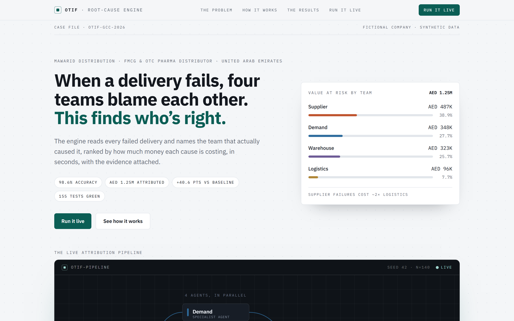
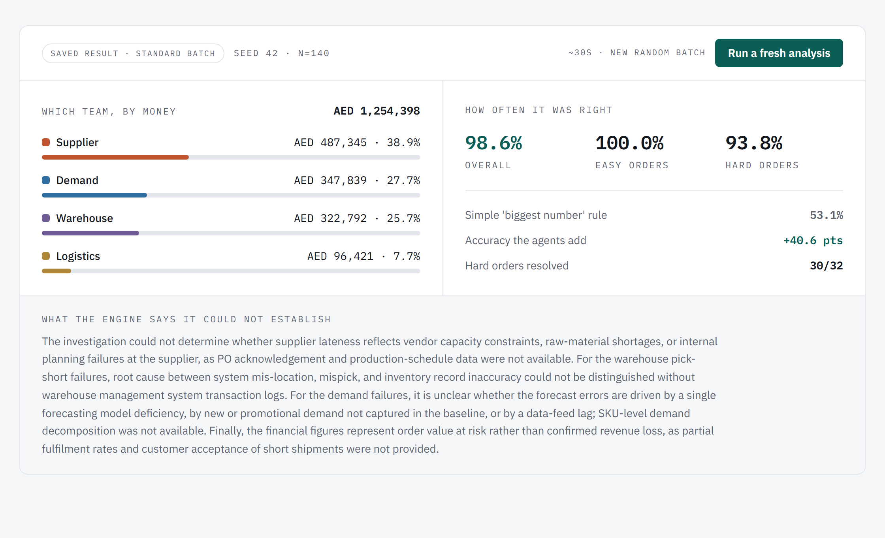

# OTIF Root-Cause Engine

[](https://github.com/Prajwal210lm/otif-root-cause-engine/actions/workflows/tests.yml)
[](https://github.com/Prajwal210lm/otif-root-cause-engine/actions/workflows/frontend.yml)

**When a delivery fails, four teams blame each other. This finds who's right.**

When a distributor's on-time-in-full (OTIF) rate slips, every failed order has four possible culprits: the demand planners who forecast it, the suppliers who shipped the stock in, the warehouse that picked and packed it, or the carrier that drove it. Usually more than one thing went wrong at once, so the teams spend days in meetings and often never agree. This engine reads every failed order, has four specialist AI agents investigate it in parallel, and a coordinator names the team that actually caused it, ranked by how much money each cause is costing, with the evidence attached. Built around a fictional GCC FMCG distributor (Mawarid Distribution) with fully synthetic data.

## Headline numbers

| Metric | Value |
|---|---|
| Overall attribution accuracy | **95.7%** (134 of 140) |
| Easy orders (one clear cause) | **100%** (104 of 104) |
| Hard orders (two causes at once, 36 of them) | **83.3%** (30 of 36) |
| Naive "blame the biggest number" baseline on the same hard orders | 61.1% (22 of 36) |
| Lift where the problem is actually hard | **+22.2 points** |
| Failure value attributed | **AED 1,226,642** across 140 failed orders |

Where the money went, by attributed cause: supplier AED 477,794 (39.0%, 51 orders), warehouse AED 313,864 (25.6%, 37), demand AED 282,823 (23.1%, 28), logistics AED 152,160 (12.4%, 24).

**Robustness, across 6 independently generated batches (seeds 42-47):** mean accuracy on hard orders is **85.5%** (range 78.1-93.9%), against 53.1-84.4% for the naive baseline over the same six batches. One batch (seed 47) is a case where the naive rule actually won; it stays in the record rather than getting dropped. The seed 46 batch above is the run closest to the six-seed mean, which is why it is the one featured throughout.

## The pipeline

```
                          ┌────────────────────┐
                     ┌───▶│  Demand agent      │───┐
                     │    ├────────────────────┤   │
 ┌───────────────┐   ├───▶│  Supplier agent    │───┤   ┌──────────────┐   ┌──────────────────┐
 │ 140 failed    │───┤    ├────────────────────┤   ├──▶│ Coordinator  │──▶│ Ranked verdict   │
 │ OTIF orders   │   ├───▶│  Warehouse agent   │───┤   │ (adjudicates │   │ + audited board  │
 └───────────────┘   │    ├────────────────────┤   │   │  the ties)   │   │   brief          │
                     └───▶│  Logistics agent   │───┘   └──────────────┘   └──────────────────┘
                          └────────────────────┘
                           4 agents, in parallel
```

Each agent sees only its own team's evidence for an order and files a claim: main cause, contributing factor, or not involved, with reasoning grounded in the order's signals. When two teams fired at once, the coordinator reads the competing claims and decides which was the real deciding cause, not just the biggest number.

**The core discipline: agents reason, tested code computes.** Three mechanisms enforce it:

- **Firewall**: agents never see the planted ground truth. Accuracy is earned, not leaked.
- **Tested computation**: every figure (shortfall, cost, accuracy) is produced by deterministic code under test. The model never does the arithmetic.
- **Render gate**: the final brief can only print numbers through placeholders bound to audited values. Any digit the model writes itself is rejected before it renders.

## Quickstart

```bash
git clone https://github.com/Prajwal210lm/otif-root-cause-engine.git
cd otif-root-cause-engine

# Backend + engine
python -m venv .venv
.venv\Scripts\activate          # Windows   (macOS/Linux: source .venv/bin/activate)
pip install -r requirements.txt
pytest                           # 181 passed, 1 skipped (opt-in live API smoke test)
uvicorn otif.api:app --port 8000

# Frontend (second terminal)
cd frontend
npm install
npm run dev                      # http://localhost:3000
```

Everything works without an API key: the tests are mocked, and the site serves the bundled canonical result. Setting `ANTHROPIC_API_KEY` (see `.env.example`) enables live fresh runs from the console.

## Architecture

```
otif/                 The Python engine (every number on the site originates here)
  constants.py        Tolerances, penalty rates, driver definitions
  types.py            Frozen dataclasses: Order, Signals, Counterfactuals, FinancialImpact
  engine.py           Deterministic signal/financial computation + the ground-truth oracle
  generator.py        Synthetic batch generator with planted causes (seeded, reproducible)
  scoring.py          Scorecards, naive baseline, lift. The ruler, proven on hand-verified fixtures
  pipeline.py         Partition (the firewall in code) and cash roll-up
  specialists.py      Specialist agent contract: prompt builder + strict report parser
  coordinator.py      Coordinator contract: prompt builder + parser + attribution reconciler
  validate.py         Render gate: placeholder substitution, bare-digit rejection
  orchestrate.py      Linear pipeline: partition -> agents -> coordinator -> rollup -> gate -> score
  graph.py            The same pipeline as a LangGraph fan-out/fan-in (agents genuinely parallel)
  client.py           Thin Anthropic client (injectable, so tests never spend)
  cache.py            Canonical-run serialization
  api.py              FastAPI: /api/health, /api/canonical (cached), /api/analyze (live, gated)

frontend/             Next.js 16 + Tailwind v4 site (the case file: Problem / How / Results / Live)
data/                 canonical_run.json: the committed live run (seed 46, N=140), self-documenting
                      via a top-level "meta" block (model, timestamp, git commit, token usage),
                      auto-stamped by cache.py every time the batch is regenerated
scripts/              run_canonical.py (the one credit-spending entry point), inspection tools
tests/                181 tests: engine fixtures, generator invariants, scoring, firewall,
                      render gate, orchestration with a mock LLM, API via TestClient,
                      fail-closed auth, rate limiting, and the concurrency guard
```

The flow: the generator plants a true cause in every synthetic failed order. The engine computes signals deterministically. Agents see only signals (never the answer), file claims, the coordinator adjudicates, and the scorer grades the result against the planted answer key. The frontend renders one source of truth: the coordinator's attributed rollup from `data/canonical_run.json`.

## Honest scope

- **The data is synthetic and the company is fictional.** Mawarid Distribution does not exist; real distributor data is confidential. The batch is built to mirror real GCC FMCG failure patterns, and every figure is illustrative.
- **Accuracy is measured, not asserted**, against planted ground truth the engine never sees. That is the point of synthetic data: it makes the score checkable.
- **The canonical result is a single seeded run** (seed 46, N=140), chosen as the batch whose hard-order accuracy sits closest to the six-seed mean below. The generator is deterministic, so anyone can regenerate the batch; fresh runs on new seeds can be triggered live from the site.
- **Robustness is verified across six independently generated batches** (seeds 42-47), not asserted from one lucky run: mean accuracy on hard orders is 85.5% (range 78.1-93.9%), against 53.1-84.4% for the naive baseline over the same six batches. One batch (seed 47) is a case where the naive rule actually won; it stays in the record.
- **The naive baseline is the standard largest-signal rule**: for each order, it normalizes every signal that fired to a comparable severity score, then picks the domain with the highest score. Its 61.1% on this batch's ambiguous orders is what that rule honestly scores, not a tuned strawman. The normalization units are fixed in `otif/constants.py`, not reverse-engineered from the score they'd produce: demand is measured in multiples of its own 15% firing threshold (the same `DEMAND_TOL` the engine uses to decide the signal fired at all), supplier lateness in weeks (divided by 7 days), warehouse in whichever is worse of a 10%-of-order-size pick shortfall or a 2-day dispatch delay, and logistics in multiples of that specific order's own lane SLA. These are not one uniform multiplier; they are domain-appropriate units chosen for interpretability before any batch was ever scored. Verify it yourself: `naive_attribution` in `otif/engine.py` next to the constants in `otif/constants.py`.
- **Sonnet was chosen on purpose.** It cleared the bar at 95.7%, so escalating to a larger, costlier model was not warranted. That is a cost decision, documented rather than hidden.
- The 6 orders the engine got wrong on this batch are disclosed on the site, with why.

## Screenshots





## Links

- **Live site**: coming soon
- **Deploying this yourself**: see [DEPLOY.md](DEPLOY.md) (Railway backend + Vercel frontend, required env vars, post-deploy checklist)
- **Sister projects**: [Liquidity Lens](https://supply-chain-liquidity-lens.vercel.app) · [Supplier Resilience Radar](https://supplier-resilience-radar.vercel.app)
- **Author**: [Prajwal on LinkedIn](https://www.linkedin.com/in/prajwal-b-006050228/)

## License

MIT. See [LICENSE](LICENSE).
